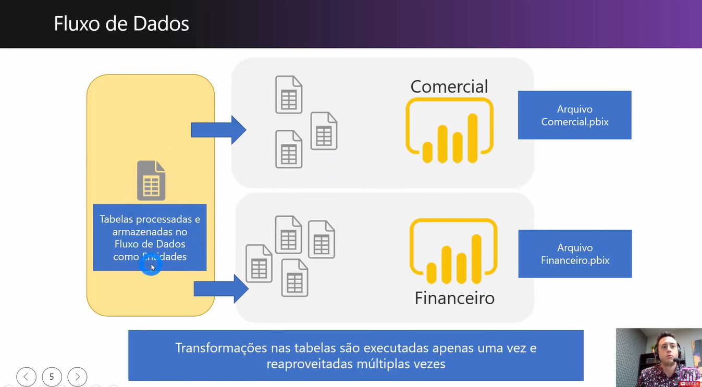

># Administração e Governança de Dados
* Governança de Dados e Arquitetura ideal com Dataflows e Shared Datasets

___
>## Fluxo de dados
* Power Query Online que pode servir como um DAta Warehouse ou camnada de Staging, para as empresas.
    * Os dados são salvos no Azure Data Lake Storange no formato de arquivos CSV
> Principais benefícios oferecidos pelo Dataflow:
1. Fornecer uma cópia das tabelas de banco de dados aos analistas de negócio;
2. Centralização e reaproveitamento das tabelas resultantes de transformações pelo Power Query;
3. Programação de diferentes horários e frequências de atualização de acordo com as entidades definidas em cada Dataflow.

___
>## Conjunto de dados compartilhados
* Ao publicar um arquivo *.PBIX*, duas estruturas s
ao criadas no Serviço Online do Power BI:
    1. Relatório;
    2. Conjunto de Dados.
* O conjunto de dados é a estrutura que contém os dados transformados, os relacionamentos e as medidas DAX. Ou seja, é nosso Modelo de Dados.
* Um conjunto de dados em um Workspace pode ser utilizado para criação de diferentes relatórios. Melhor ainda, é possível publicar esses relatórios em diferentes workspace.