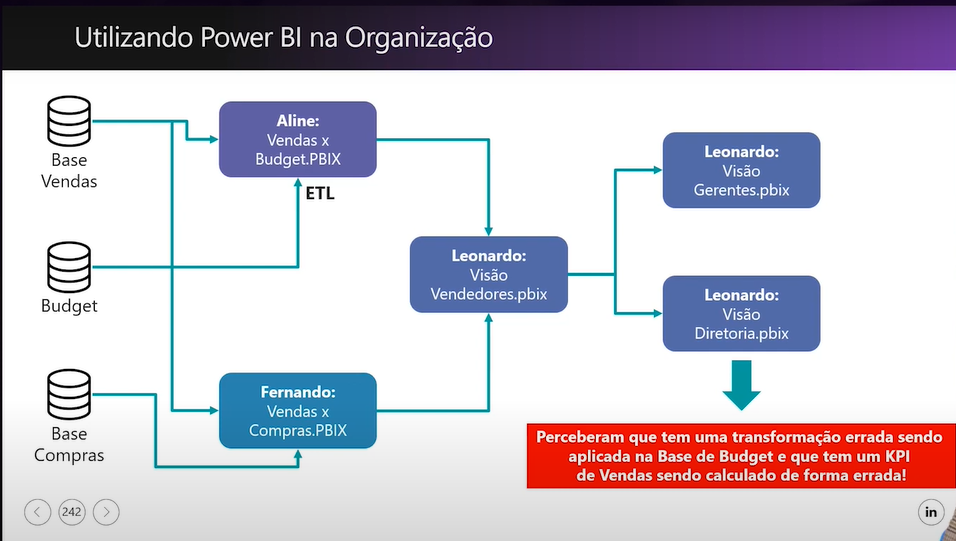

># Cenário nas empresas antes do Power BI
* Uso de Excel pelos analistas;
* Tarefas repetitivas e demoradas o tempo todo;
* Demova no processamento das informações;
* Alta dependência da TI para extração de dados;
* Compartilhamento das informações por E-mail (relatório_final.xlsx).

>## Utilizando Power BI na organização
    Nota-se que não há organização(padrão) para criação dos Dashboards, com isso, para fazer uma correção no final dessa segmentação, é preciso reazer todos os outros anteriores. Fazendo com que haja mais dificuldade para fazer a manutenção.

>### Problemas comuns encontrados no uso do Power BI
* Trabalhos repetidos: as mesmas transformações de dados presentes em diferentes arquivos PBIX;
* Falta de padronização nos processos: diferentes pessoas realizando ETL de maneiras diferentes;
* Criação de diversos modelos de dados com os mesmos dados e medidas DAX repetidas;
* Troca de arquivos PBIX entre colegas de trabalho
* __Resultado final: dificuldades de manutenção e criação silos de dados totalmente sem padronização! Qualquer mudança precisa ser realizada em inúmeros locais de forma manual e repetitiva.__

* [Link da vídeo aula](https://www.youtube.com/watch?v=Ej8bGfbJwUs&list=PLL-6y89GGNdSu9utTLYuzwPGNXQNT0KWm&index=3)